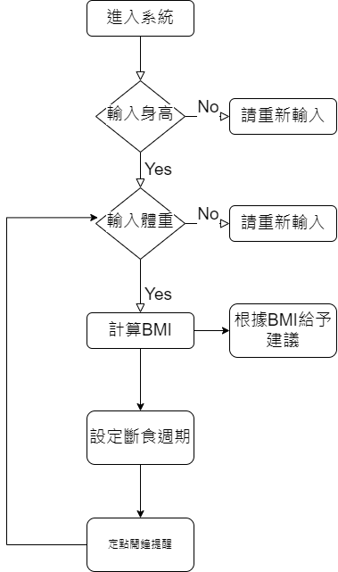
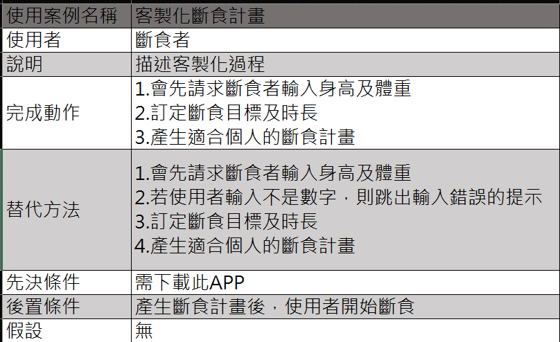

---
## 功能性需求與非功能性需求
+ > 功能性需求：
  
   + >客製化斷食排程
      + >輸入身高
      + >輸入體重
      + >輸入斷食原因
      + >曾經是否斷食
      + >斷食目標
      + >選擇計畫時長   

   + >斷食與進食計時器
      + >紀錄斷食時間
      + >紀錄進食時間

   + >提醒通知
      + >斷食時間通知
      + >進食時間通知
      + >補充水分通知

   + >我的頁面
      + >個人資料更改
      + >斷食紀錄(包含總斷食時數、斷食紀錄、斷食圖表...)
      + >飲食紀錄
      + >身體紀錄(身高、體重、BMI...)

   + >關於斷食
      + >斷食方法總攬
      + >斷食期間症狀
      + >斷食小技巧
      + >斷食須知

* > 非功能性需求：
   + >可維護性
      + >方便維護系統
      + >減少對核心程式的變更
     
   + >系統平台相容性
      + >ios os及安卓 os 的各別優化

   + >隱私權
      + >保護使用者資訊
      + >落實保護隱私權制度

   + >可用性
     
---
## 功能分解圖

---
## 需求分析的文字描述
1. 使用者優先輸入關係資料(身高、體重等等)
2. 使用者通過客製化的斷食計畫進行斷食
3. 根據計畫隨時追蹤斷食進度及狀況
4. 使用者也可以在斷食期間根據自己的狀況進行修改計畫的動作
5. 在資料紀錄的方面，使用者可以查詢個人的斷食紀錄以及當時的飲食紀錄
6. 使用者可以在斷食期間，更了解斷食的方法、症狀以及技巧等。

---
## 使用案例圖

---
## 使用案例說明

---
## 使用Figma劃出第一個使用案例的動態模擬畫面

---
