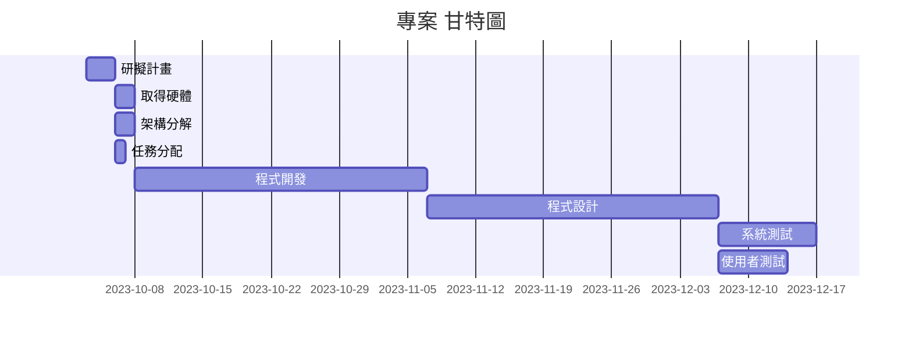

# 專案管理 小組14

## 分工表
|   編號   |   任務內容   |   所需時(天)   |   前置任務   |   負責人   |
| :------: |   :------:  |    :------:   |   :------:  |  :------:  |
|     1    |   研擬計畫   |       3       |      /      |簡敬庭、翁嘉駿、范振偉|
|     2    |   取得硬體   |       2       |      1      |簡敬庭、翁嘉駿、范振偉|
|     3    |   架構分解   |       2       |      1      |簡敬庭、翁嘉駿、范振偉|
|     4    |   任務分配   |       1       |      1      |簡敬庭、翁嘉駿、范振偉|
|     5    |   程式開發   |       30       |      2      |簡敬庭、翁嘉駿、范振偉|
|     6    |   程式設計   |       30      |      5      |簡敬庭、翁嘉駿、范振偉|
|     7    |   系統測試   |       10      |      6      |簡敬庭、翁嘉駿、范振偉|
|     8    |  使用者測試  |       7       |      6      |簡敬庭、翁嘉駿、范振偉|

## 甘特圖

## PERT

## 功能性需求與非功能性需求
### 功能性需求：

### 非功能性需求：

## 功能分解圖

---

## 需求分析的文字描述
1. 
2. 
3. 
4. 
5. 
6. 
7. 

## 使用案例圖

## 使用案例說明

## 使用Figma劃出第一個使用案例的動態模擬畫面
<>
