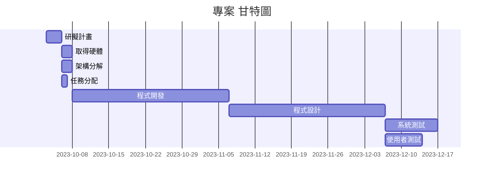

# 專案管理 小組14

## 甘特圖

```mermaid
gantt
    title 專案 甘特圖

    研擬計畫     : a1 , 2023-10-03 , 3d
    取得硬體     : a2 , after a1 , 2d
    架構分解     : a3 , after a1 , 2d
    任務分配     : a4 , after a1 , 1d
    程式開發     : a5 , after a2 , 30d
    程式設計     : a6 , after a5 , 30d
    系統測試     : a7 , after a6 , 10d
    使用者測試   : a8 , after a6 , 7d

```
## PERT

