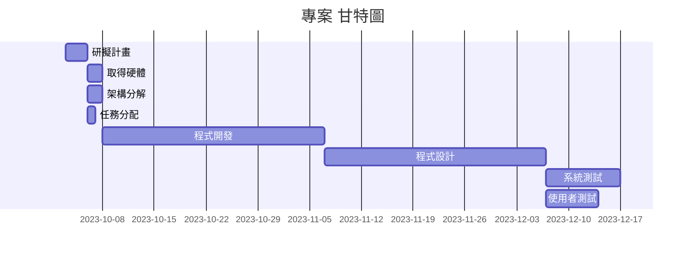
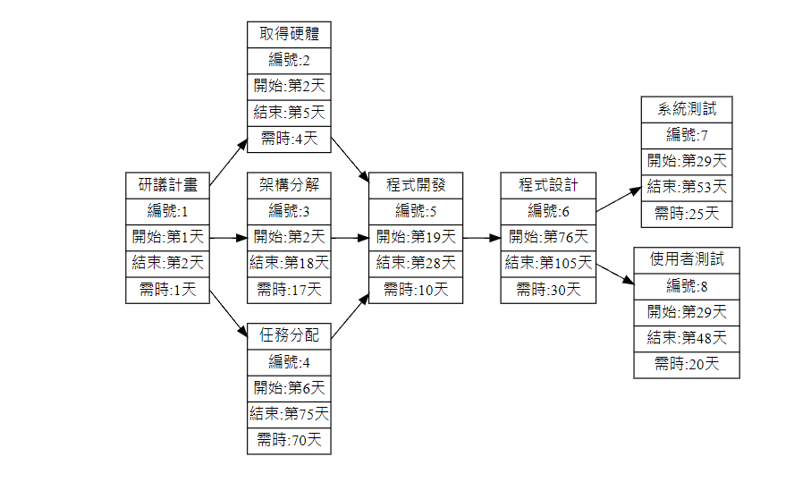
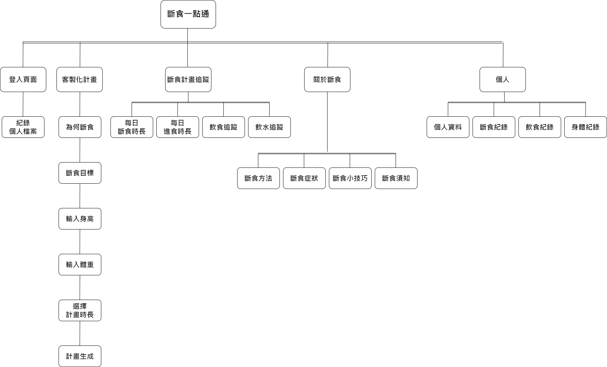
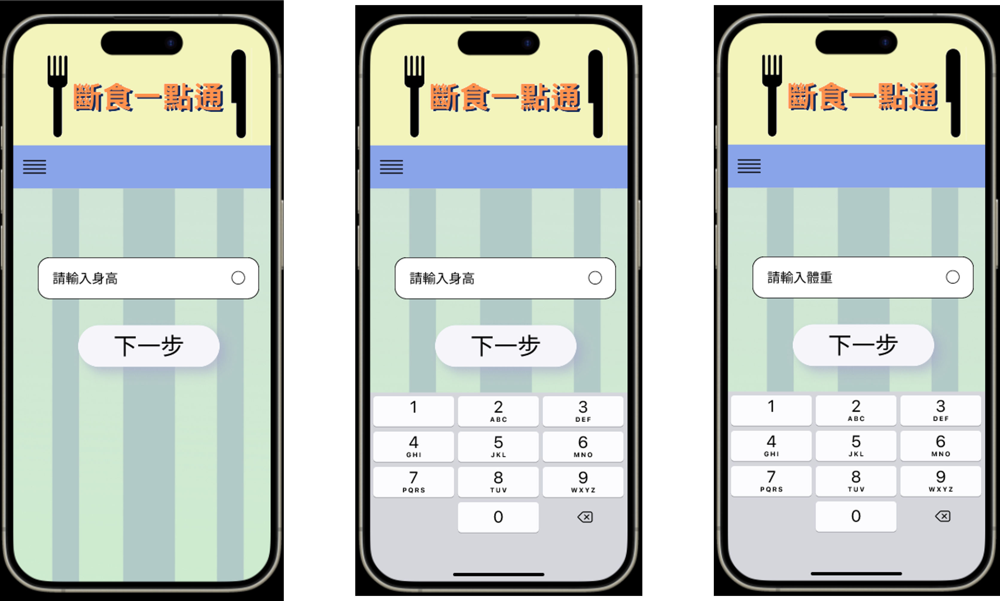

# 專案管理 小組14

## 分工表
|   編號   |   任務內容   |   所需時(天)   |   前置任務   |   負責人   |
| :------: |   :------:  |    :------:   |   :------:  |  :------:  |
|     1    |   研擬計畫   |       3       |      /      |簡敬庭、翁嘉駿、范振偉|
|     2    |   取得硬體   |       2       |      1      |簡敬庭、翁嘉駿、范振偉|
|     3    |   架構分解   |       2       |      1      |簡敬庭、翁嘉駿、范振偉|
|     4    |   任務分配   |       1       |      1      |簡敬庭、翁嘉駿、范振偉|
|     5    |   程式開發   |       30      |      2      |簡敬庭、翁嘉駿、范振偉|
|     6    |   程式設計   |       30      |      5      |簡敬庭、翁嘉駿、范振偉|
|     7    |   系統測試   |       10      |      6      |簡敬庭、翁嘉駿、范振偉|
|     8    |  使用者測試  |       7       |      6      |簡敬庭、翁嘉駿、范振偉|

## 甘特圖

## PERT

## 功能性需求與非功能性需求
+ > 功能性需求：
  
   + >客製化斷食排程
      + >輸入身高
      + >輸入體重
      + >輸入斷食原因
      + >曾經是否斷食
      + >斷食目標
      + >選擇計畫時長   

   + >斷食與進食計時器
      + >紀錄斷食時間
      + >紀錄進食時間

   + >提醒通知
      + >斷食時間通知
      + >進食時間通知
      + >補充水分通知

   + >我的頁面
      + >個人資料更改
      + >斷食紀錄(包含總斷食時數、斷食紀錄、斷食圖表...)
      + >飲食紀錄
      + >身體紀錄(身高、體重、BMI...)

   + >關於斷食
      + >斷食方法總攬
      + >斷食期間症狀
      + >斷食小技巧
      + >斷食須知

* > 非功能性需求：
   + >
      + >輸入身高
      + >輸入體重
      + >輸入斷食原因
      + >曾經是否斷食

   + >斷食與進食計時器
      + >紀錄斷食時間
      + >紀錄進食時間

   + >提醒通知
      + >斷食時間通知
      + >進食時間通知
      + >補充水分通知

   + >我的頁面
      + >個人資料更改
      + >斷食紀錄(包含總斷食時數、斷食紀錄、斷食圖表...)
      + >飲食紀錄
      + >身體紀錄(身高、體重、BMI...)

## 功能分解圖

---

## 需求分析的文字描述
1. 使用者優先輸入關係資料(身高、體重等等)
2. 使用者通過客製化的斷食計畫進行斷食
3. 根據計畫隨時追蹤斷食進度及狀況
4. 使用者也可以在斷食期間根據自己的狀況進行修改計畫的動作
5. 在資料紀錄的方面，使用者可以查詢個人的斷食紀錄以及當時的飲食紀錄
6. 使用者可以在斷食期間，更了解斷食的方法、症狀以及技巧等。

## 使用案例圖

## 使用案例說明

## 使用Figma劃出第一個使用案例的動態模擬畫面

