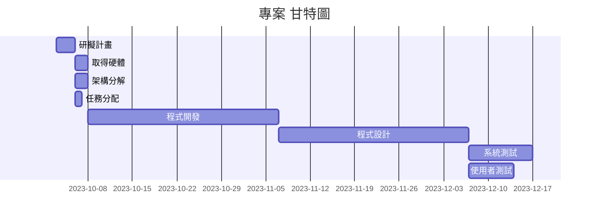

# 專案管理 小組14

### 分工表
|  *編號*  |  *任務內容*  |  *所需時(天)*  |  *前置任務*  |  *負責人*  |
| :------: |   :------:  |    :------:   |   :------:  |  :------:  |
|     1    |   研擬計畫   |       3       |      /      |張絜雅、康悅菱、李宜珃、夏嘉敏|
|     2    |   取得硬體   |       2       |      1      |張絜雅、康悅菱、李宜珃、夏嘉敏|
|     3    |   架構分解   |       2       |      1      |張絜雅、康悅菱、李宜珃、夏嘉敏|
|     4    |   任務分配   |       1       |      1      |張絜雅、康悅菱、李宜珃、夏嘉敏|
|     5    |   程式開發   |       30       |      2      |張絜雅、康悅菱、李宜珃、夏嘉敏|
|     6    |   程式設計   |       30      |      5      |張絜雅、康悅菱、李宜珃、夏嘉敏|
|     7    |   系統測試   |       10      |      6      |張絜雅、康悅菱、李宜珃、夏嘉敏|
|     8    |  使用者測試  |       7       |      6      |張絜雅、康悅菱、李宜珃、夏嘉敏|

## 甘特圖

## PERT

